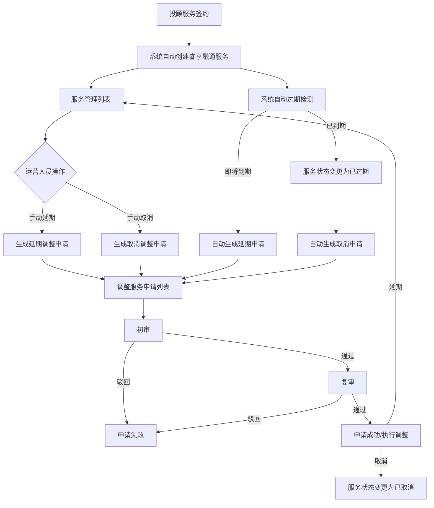

# 睿享融通服务管理系统 — 产品需求文档

## 1. 产品概述

"睿享融通"是广发证券证金业务平台下的投顾品牌服务，旨在为两融高净值客户提供增值投顾服务。本系统用于支撑睿享融通服务的全生命周期管理，包括新增申请、服务管理、调整申请审批等核心业务流程的线上化运营。

- **目标用户**：证金业务运营人员（录入/初审）、复核人员（复审）、管理人员（查看）
- **核心价值**：提高运营管理效率，确保补贴计算准确性，实现服务全流程可追溯

## 2. 核心功能

### 2.1 用户角色

| 角色 | 核心权限 |
|------|----------|
| 录入人（运营人员） | 查询列表、新增睿享融通申请、服务延期申请 |
| 初审人员 | 查询调整申请、执行初审（通过/驳回） |
| 复审人员 | 查询调整申请、执行复审-延期/复审-取消（通过/驳回） |
| 系统 | 自动触发服务创建、自动过期处理、自动生成延期/取消申请、定时取消处理 |

### 2.2 功能模块

1. **新增申请**：查询已有申请记录 + 发起新的睿享融通服务申请
2. **服务管理**：查询所有睿享融通服务记录 + 手动延期 + 手动取消
3. **调整服务申请**：查询调整申请记录 + 初审审批 + 复审（延期/取消）审批

### 2.3 页面详情

| 页面名称 | 模块名称 | 功能描述 |
|----------|----------|----------|
| 新增申请 | 查询列表 | 按申请状态、申请资格客户编号/名称、补贴客户编号/名称、服务编号、发起日期等条件筛选；展示申请编号、服务编号、申请状态、客户信息、补贴金额、日期、流程标题等字段；支持分页 |
| 新增申请 | 新增表单（弹窗） | 填写申请资格客户编号/名称、补贴客户编号/名称、补贴金额、最多可补贴期数、投顾服务信息等；提交后生成申请记录进入待审批状态 |
| 服务管理 | 查询列表 | 按服务状态、客户编号/名称、日期范围、投顾人员、服务编号等条件筛选；展示26个字段包含服务编号、状态、客户信息、补贴期数/金额、日期、净利息收入、投顾服务、流程标题、操作记录等；支持导出 |
| 服务管理 | 延期（弹窗） | 选择服务记录、填写申请服务起止日期、申请说明；提交后生成延期调整申请 |
| 服务管理 | 取消（弹窗） | 选择服务记录、填写取消原因；提交后生成取消调整申请 |
| 调整服务申请 | 查询列表 | 按申请状态、申请类型、客户编号/名称、服务编号、发起日期等条件筛选；展示19个字段；支持分页 |
| 调整服务申请 | 初审（弹窗） | 查看申请详情、填写审批意见、选择通过/驳回 |
| 调整服务申请 | 复审-延期（弹窗） | 查看申请详情和初审意见、填写复审意见、选择通过/驳回 |
| 调整服务申请 | 复审-取消（弹窗） | 查看申请详情和初审意见、填写复审意见、选择通过/驳回 |

## 3. 核心流程



### 申请状态流转

```
待审批 → 待复核 → 待处理 → 申请成功/失败
```

### 服务状态流转

```
正常 → 已过期 / 已取消 / 异常
```

## 4. 用户界面设计

### 4.1 设计风格

- **主色**：#2A6CDD（广发蓝），深色导航背景 #0C1D43
- **按钮风格**：扁平圆角按钮，圆角 2px，高度 32px
- **字体**：Microsoft YaHei / PingFang SC 为主字体，DIN Alternate 用于数字列
- **布局**：左侧导航 + 顶部导航 + 多标签页 + 内容区（卡片式）
- **表格**：斑马纹交替（#FAFCFF / #FFFFFF），表头背景 #F7F8FA，固定右侧操作列

### 4.2 页面设计概览

| 页面名称 | 模块名称 | UI 元素 |
|----------|----------|---------|
| 新增申请 | 筛选区 | 4列网格布局，筛选字段 + 查询/重置按钮 |
| 新增申请 | 数据表格 | 斑马纹表格，右侧固定操作列（新增按钮） |
| 新增申请 | 新增弹窗 | 双列表单布局，必填项红星标识，提交/取消按钮 |
| 服务管理 | 筛选区 | 4列网格布局，多选下拉（服务状态），日期范围选择器 |
| 服务管理 | 数据表格 | 26列斑马纹表格，数字列使用DIN字体，固定操作列（延期/取消） |
| 服务管理 | 延期弹窗 | 双列表单，自动计算日期，申请说明文本框（300字限制） |
| 服务管理 | 取消弹窗 | 双列表单，取消原因文本框 |
| 调整服务申请 | 筛选区 | 4列网格布局，多选下拉（申请状态），单选下拉（申请类型） |
| 调整服务申请 | 数据表格 | 19列斑马纹表格，动态操作按钮（初审/复审/查看） |
| 调整服务申请 | 审批弹窗 | 申请详情展示 + 审批意见输入 + 通过/驳回按钮 |

### 4.3 响应式设计

桌面优先设计，支持 1440px 标准分辨率。侧边栏 208px 固定宽度，表格支持横向滚动，筛选区在 1200px 以下缩减为 2 列。

## 5. 数据字段定义

### 服务管理核心字段

| 字段名 | 类型 | 说明 |
|--------|------|------|
| 服务编号 | 文本 | 唯一标识，格式 RXRTFW + 8位数字 |
| 服务状态 | 枚举 | 正常/已过期/已取消/异常 |
| 申请资格客户编号 | 文本 | 可多客户，用"/"分隔 |
| 申请资格客户名称 | 文本 | 对应客户名称 |
| 补贴客户编号 | 文本 | 接收补贴的客户 |
| 补贴客户名称 | 文本 | 对应客户名称 |
| 当前补贴期数 | 数字 | 如 2（表示第2期） |
| 最多可补贴期数 | 数字 | 如 4 |
| 补贴金额 | 金额 | 如 50,000.00 |
| 投顾服务服务代码 | 文本 | 关联投顾服务 |
| 投顾人员 | 文本 | 负责投顾 |

### 调整申请核心字段

| 字段名 | 类型 | 说明 |
|--------|------|------|
| 申请编号 | 文本 | 格式 RXRTSQ + 8位数字 |
| 申请类型 | 枚举 | 新增/延期/取消 |
| 申请状态 | 枚举 | 待审批/待复核/待处理/申请成功/申请失败 |
| 申请说明 | 文本 | 申请原因描述 |