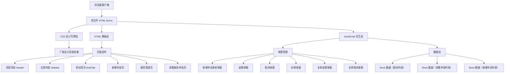

# 睿享融通服务管理系统 — 技术架构文档

## 1. 架构设计



## 2. 技术选型

- **前端框架**：纯 HTML5 + CSS3 + Vanilla JavaScript（单文件 Demo）
- **设计系统**：广发中后台设计令牌（CSS Variables）
- **图标方案**：内联 SVG
- **数据方案**：JavaScript Mock 数据数组
- **字体**：Microsoft YaHei / PingFang SC（主字体）+ DIN Alternate（数字列）

## 3. 页面路由定义

由于 Demo 采用单文件 + 多标签页架构，页面切换通过 JavaScript 控制 CSS 显隐实现。

| 页面 ID | 页面名称 | 说明 |
|---------|----------|------|
| new-apply | 新增申请 | 查询新增申请列表 + 新增表单弹窗 |
| service-manage | 服务管理 | 查询服务列表 + 延期/取消弹窗 |
| adjust-apply | 调整服务申请 | 查询调整申请列表 + 初审/复审弹窗 |

## 4. 组件结构

### 4.1 布局组件（全局）

| 组件 | CSS 类前缀 | 说明 |
|------|-----------|------|
| 顶部导航 | `.gf-header` | 固定顶部，高度 64px，深色背景 #0C1D43 |
| 左侧导航 | `.gf-sidebar` | 固定左侧，宽度 208px，可展开/收起子菜单 |
| 多标签页 | `.gf-multitab` | 固定顶部（header 下方），高度 40px，支持动态增删 |
| 内容区 | `.gf-main` | 左侧偏移 208px，顶部偏移 64px |

### 4.2 通用组件

| 组件 | CSS 类前缀 | 说明 |
|------|-----------|------|
| 卡片 | `.gf-card` | 白色背景，阴影 0px 2px 8px rgba(0,0,0,0.10)，圆角 4px |
| 按钮 | `.gf-btn` | 多种变体：primary/default/text/danger-text，尺寸 sm/lg |
| 表格 | `.gf-table` | 斑马纹，固定操作列，数字列 DIN 字体 |
| 标签 | `.gf-tag` | 状态标签：success/warning/error/info/default |
| 分页器 | `.gf-pagination` | 页码导航 + 每页条数 + 快速跳转 |
| 模态框 | `.gf-modal` | 弹窗：标题 + 内容 + 底部按钮 |
| 筛选区 | `.gf-filter` | 4列网格布局，支持多选下拉、日期范围 |
| 工具栏 | `.gf-toolbar` | 左操作按钮 + 右记录数统计 |
| 面包屑 | `.gf-breadcrumb` | 导航路径：链接色 #2A6CDD，当前页 #262626 |
| 多选下拉 | `.gf-multi-select` | 自定义多选下拉组件 |
| 提示 | `.gf-alert` | 信息/警告提示条 |

### 4.3 弹窗组件

| 弹窗 | 触发场景 | 核心字段 |
|------|----------|----------|
| 新增申请弹窗 | 新增申请页点击"新增" | 客户信息、补贴金额、期数、投顾服务、日期 |
| 延期弹窗 | 服务管理页点击"延期" | 服务编号、客户信息、申请日期、申请说明 |
| 取消弹窗 | 服务管理页点击"取消" | 服务编号、客户信息、取消原因 |
| 初审弹窗 | 调整申请页点击"初审"（待审批状态） | 申请详情、审批意见 |
| 复审延期弹窗 | 调整申请页点击"复审"（待复核+延期类型） | 申请详情、初审意见、复审意见 |
| 复审取消弹窗 | 调整申请页点击"复审"（待复核+取消类型） | 申请详情、初审意见、复审意见 |

## 5. 数据模型（Mock）

### 5.1 新增申请数据

```javascript
{
  applyNo: string,        // 申请编号 RXRTSQ + 8位数字
  serviceNo: string,      // 服务编号（新增时为空）
  applyType: string,      // 申请类型：新增
  applyStatus: string,    // 申请状态：待审批/待复核/待处理/申请成功/申请失败
  qualCustNo: string,     // 申请资格客户编号
  qualCustName: string,   // 申请资格客户名称
  qualCustOrg: string,    // 申请资格客户所在机构
  subsidyCustNo: string,  // 补贴客户编号
  subsidyCustName: string,// 补贴客户名称
  subsidyCustOrg: string, // 补贴客户所在机构
  amount: string,         // 补贴金额
  maxPeriod: string,      // 最多可补贴期数
  serviceCode: string,    // 投顾服务服务代码
  serviceName: string,    // 投顾服务服务名称
  advisor: string,        // 投顾人员
  applyStart: string,     // 申请服务开始日期
  applyEnd: string,       // 申请服务到期日期
  applyDesc: string,      // 申请说明
  flowTitle: string,      // 流程标题
  applyDate: string,      // 申请日期
  entryTime: string,      // 录入时间
  entryBy: string,        // 录入人
  updateTime: string,     // 最近更新时间
  updateBy: string,       // 最近更新人
}
```

### 5.2 服务管理数据（已有，26字段）

### 5.3 调整服务申请数据（已有，19字段）

## 6. 文件结构

```
中后台系统设计知识库/
├── .trae/documents/
│   ├── PRD-睿享融通服务管理系统.md
│   └── TECH-睿享融通服务管理系统.md
├── ruixiang-rongtong-demo.html          # 完整 Demo 文件
├── design-specs/                         # 设计规范文档
│   ├── foundation/tokens.md
│   ├── components/
│   │   ├── navigation.md
│   │   ├── data-display.md
│   │   └── business.md
│   └── pages/
│       ├── list-page.md
│       └── form-page.md
└── 睿享融通服务设计方案.doc              # 原始需求文档
```